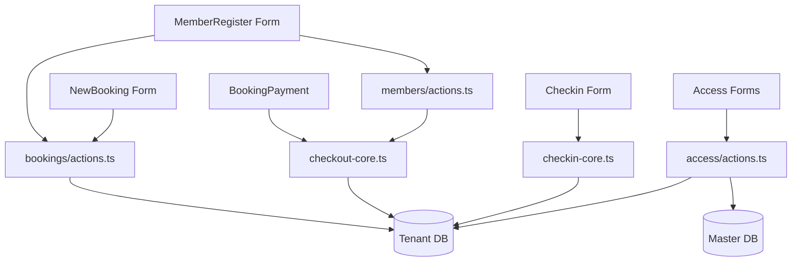

# PadelPro — Forms & User Flows

**Updated:** 2026-06-22

---

## Form Architecture

PadelPro memakai pola **form lokal di client component + server action co-located**.

Pattern umum:

```tsx
"use client";
const [field, setField] = useState(...);
const [saving, setSaving] = useState(false);
const [submitted, setSubmitted] = useState(false);

const res = await someAction(input);
if (!res.success) toast.error(res.error);
else toast.success(...);
```

Server action pattern:

```ts
"use server";
const guard = await requirePermission("resource.key", "create|update|delete");
if (!guard.ok) return { success: false, error: guard.error };
const db = await getTenantDb();
await db.model.create/updateMany(...auditCreate/auditUpdate(session.userId));
revalidatePath("/route");
return { success: true };
```

---

## Shared Form UI

### `src/components/form/`

| File | Purpose |
|------|---------|
| `Form.tsx` | Basic form wrapper |
| `Label.tsx` | Label component |
| `Select.tsx` | Select input |
| `MultiSelect.tsx` | Multi select input |
| `date-picker.tsx` | Date picker |
| `input/` | Input primitives |
| `group-input/` | Grouped inputs |
| `switch/` | Switch inputs |

### `src/components/ui/`

Form-heavy primitives:
- `input/TextInput.tsx`
- `input/PhoneInput.tsx`
- `input/InputLabel.tsx`
- `select/Select.tsx`
- `datepicker/DatePicker.tsx`
- `datepicker/TimePicker.tsx`
- `modal/index.tsx`
- `drawer/Drawer.tsx`
- `toast/ToastContext.tsx`
- `button/Button.tsx`
- `card/Card.tsx`

### Drawer Pattern

**File:** `src/components/ui/drawer/Drawer.tsx`

Features:
- `isOpen`, `onClose`, `side`, `size`, `title`, `footer`
- closes on Escape
- locks body scroll when open
- supports left/right/top/bottom sheet

Used for edit/create panels like member detail, class form, product form, promo builder.

---

## Major Forms

## 1. Member Registration Form

**Page:** `src/app/(admin)/members/register/page.tsx`  
**Component:** `src/components/club-core/MemberRegister.tsx`  
**Action:** `src/app/(admin)/members/actions.ts::registerMemberAction`

### Purpose

Register new member, optionally assign membership plan, optionally create initial court bookings.

### Form Sections

1. **Identitas**
   - name
   - username
   - phone
   - email

2. **Membership Plan**
   - planId from `getActivePlansAction()`
   - default highlighted plan else first plan
   - join fee
   - included court quota
   - court discount

3. **Court Booking Optional**
   - enabled with switch
   - uses `CourtBookingStep`
   - draft bookings held in local state
   - price calculated with `calcMembershipBenefit()`

4. **Summary / Confirmation**
   - total join fee + court payable
   - shows benefit/quota impact

### Client Validation

```ts
const identityValid =
  name.trim().length >= 2 &&
  username.trim().length >= 3 &&
  phone.replace(/\D/g, "").length >= 8 &&
  emailValid(email);
```

### Submit Flow

1. `setSubmitted(true)`
2. validate identity
3. map `courtDrafts` → `BookingDraftInput[]`
4. call `registerMemberAction({ name, username, phone, email, planId, collectJoinFee: true, bookings })`
5. if success:
   - mirror draft bookings to `ClubDataContext.addBooking()` for instant calendar update
   - show generated `memberNo`, `username`, `tempPassword`
   - toast success

### Server Flow

`registerMemberAction`:
1. require session
2. generate `memberNo` (`PHB-2026-xxxx`)
3. generate temp password (10 chars, no ambiguous chars)
4. bcrypt hash password
5. create `t_member`
6. if `planId`: assign plan and membership history/payment
7. if `bookings`: create booking transaction
8. return `{ success, id, memberNo, username, tempPassword }`

---

## 2. Registration Court Booking Step

**Component:** `src/components/club-core/register/CourtBookingStep.tsx`

### Purpose

Optional court bookings inside member registration.

### UX Flow

1. Pick date + earliest start time
2. Click **Cari**
3. Show available start times across all active courts
4. Pick a time
5. Show available courts at that time
6. Click court → add 60-min session draft
7. Multiple drafts allowed unless `lockedToday` true

### Availability Logic

Occupied slots combine:
- existing bookings with status not `cancelled`
- current local drafts
- maintenance records

Storage granularity:
- `STORAGE_SLOT_MINUTES = 30`
- fixed registration session = 60 minutes = 2 storage slots

### Props

```ts
interface CourtBookingStepProps {
  quota: number;
  lockedToday?: boolean;
  courts: Court[];
  bookings: Booking[];
  maintenance?: MaintenanceRecord[];
  drafts: DraftBooking[];
  onAdd: (b: Omit<DraftBooking, "id">) => void;
  onRemove: (id: string) => void;
}
```

---

## 3. New Booking Form

**Page:** `src/app/(admin)/bookings/new/page.tsx`  
**Component:** `src/components/booking/NewBookingStepper.tsx`  
**Action:** `src/app/(admin)/bookings/actions.ts::createBookingsAction`

### Purpose

Owner/staff create booking transaction.

Despite name `Stepper`, current UI is a **single-page grouped form**.

### Sections

1. Court selection
2. Date + time + duration
3. Customer type
   - member
   - walk-in
4. Member/customer selection
5. Payment / promo / referral
6. Summary

### Client State

Key state:
- `courtId`
- `dateKey`
- `hour`
- `duration`
- `customerKind`
- member/customer fields
- payment method
- promo/referral input

### Availability

- active courts only
- existing bookings block occupied slots
- cancelled bookings ignored
- peak hour pricing from `isPeakHour`
- membership benefit from `useMembership()` and `calcMembershipBenefit`

### Server Flow

`createBookingsAction`:
1. `requirePermission("booking.new", "create")`
2. validate details length
3. `getTenantDb()`
4. calculate `courtTotal`, `quotaConsumed`, `joinFee`
5. create `t_booking` header
6. nested create `t_booking_detail[]`
7. if member + quota consumed: update `t_member.quotaUsed`
8. `revalidatePath("/bookings")`
9. return booking id

### Important Note

`createBookingsAction` persists `joinFee` on `t_booking` for booking checkout. Membership assignment flow uses `t_membership_history` + `t_payment`; comments warn join fee must not be written on booking for membership purchase flow.

---

## 4. Booking Payment Flow

**Component:** `src/components/booking/BookingPayment.tsx`  
**Core:** `src/lib/checkout-core.ts::runCheckout`

### Purpose

Unified checkout for:
- membership fee
- court booking fee
- payment method

### Core Rule

`runCheckout()` executes all writes in one DB transaction.

Order:
1. validate payment method
2. apply membership first (so pricing sees new plan)
3. resolve benefit + price court bookings
4. enforce cash received >= total
5. record payment
6. link payment to history/booking

---

## 5. Member Detail Drawer / Edit Forms

**Component:** `src/components/club-core/MemberDetailDrawer.tsx`  
**Actions:** `src/app/(admin)/members/actions.ts`

### Actions

| Action | Purpose |
|--------|---------|
| `updateMemberAction` | edit profile fields |
| `assignMemberPlanAction` | assign/extend/upgrade/clear plan |
| `deleteMemberAction` | soft delete member |
| `getMemberMembershipHistoryAction` | history list |

### assignMemberPlanAction Flow

1. `requirePermission("members.data", "update")`
2. find member
3. if `planId` null:
   - clear plan
   - reset quota/cycle/joinFeePaid
   - no payment/history (admin correction)
4. else:
   - find active plan
   - action = assign / extend / upgrade
   - transaction:
     - `applyMembershipAction()`
     - if joinFee > 0: `recordPayment()` cash
     - link payment to `t_membership_history`
5. `revalidatePath("/members")`

---

## 6. Access / RBAC Forms

**Actions:** `src/app/(admin)/access/actions.ts`

### Forms

Routes:
- `/access/roles`
- `/access/menus`
- `/access/staff`
- `/access/users`

### Role Form

`upsertRoleAction(id, input)`:
1. require `access.roles` create/update
2. validate name
3. if update: update name/description/scope/level
4. if create:
   - derive key from name if missing
   - ensure key unique
   - create `m_role`
5. revalidate `/access/roles`

`deleteRoleAction(id)`:
1. block deleting `superadmin`
2. check tenant `m_user` for role usage
3. if used, return error
4. soft-delete role and delete menu grants

### Menu Permission Form

Uses `m_role_menu` matrix:
- canView
- canCreate
- canUpdate
- canDelete
- canCancel
- canImport
- canExport

This drives:
- sidebar visibility via `AccessContext`
- page-level access via `AdminLayout.canViewPath()`
- server-action guard via `requirePermission()`

---

## 7. Coaching Forms

**Actions:** `src/app/(admin)/coaching/actions.ts`

### Coach Form

`createCoachAction(input)`:
- permission `coaching.coaches:create`
- fields: name, level, status, phone, email, color, ratePerHour, specialties, bio, availability
- availability normalized by `normalizeAvailability()`
- writes `m_coach`

### Coaching Package / Class / PT

Coaching module uses `src/lib/coaching.ts` helpers:
- `makeDefaultAvailability`
- `normalizeAvailability`
- `generateSlots`
- `assignCoachForSlot`
- `localIso`

Flow pattern:
1. create coach/package/class input
2. normalize schedule/availability
3. generate slots if recurring schedule
4. assign coach for slot
5. write `t_coaching_session` or related rows

---

## 8. Check-in Forms

**Page:** `src/app/(admin)/checkin/page.tsx`  
**Actions:** `src/app/(admin)/checkin/actions.ts`  
**Core:** `src/lib/checkin-core.ts`

### Forms

- Camera QR scanner (`CameraScanner.tsx`)
- Manual booking/member input
- Staff QR display (`RealQrCode.tsx`)

### Flow

1. user scans QR or enters code manually
2. action validates session + tenant
3. verify booking token if member QR
4. `performCheckin()` validates booking/time/court maintenance
5. update detail status + write `t_checkin`
6. return success/rejected reason

---

## 9. Court / Maintenance Forms

**Files:**
- `src/components/club-core/CourtForm.tsx`
- `src/components/club-core/MaintenanceManager.tsx`
- `src/app/(admin)/courts/actions.ts`
- `src/app/(admin)/maintenance/actions.ts`

### Court Form

Likely fields:
- name
- surface/type
- format (single/double)
- active/maintenance status
- base price / peak price

### Maintenance Flow

Maintenance records block availability in booking and registration court picker.

Consumers:
- `CourtBookingStep.occupiedFor()`
- `NewBookingStepper` availability logic
- `performCheckin()` court maintenance validation

---

## Cross-Flow Data Dependencies



---

## Validation & Error Handling Pattern

### Client

- `submitted` flag controls error display
- local validation before server action
- `saving` blocks duplicate submit
- toast shows success/error
- some flows mirror result to local context for instant UI update

### Server

- permission guard first
- tenant resolution second
- validate entity exists + belongs to current company
- use `updateMany` for tenant-scoped updates where possible
- catch unexpected errors and return generic Indonesian error message
- log detailed error to console

---

## Important Risks / Gaps to Watch

1. `NewBookingStepper` name says stepper but UI now grouped single-page form.
2. Some client forms still use mock fallback data (`mockMembers`, `courtById`) alongside DB data.
3. `MemberRegister` mirrors bookings into `ClubDataContext` after server success; must ensure no divergence if server returns partial data.
4. `createBookingsAction` has no explicit overlap guard in server action shown; availability is mostly client-side unless guarded elsewhere.
5. `deleteRoleAction` allows delete if tenant lookup fails (`catch {}` fallthrough); can hide tenant DB failure.
6. Join fee handling differs by flow: membership purchase should use `t_membership_history` + `t_payment`; booking action can store `joinFee` on booking for booking checkout.

---

## Files to Revisit for Deeper Audit

- `src/components/booking/BookingPayment.tsx`
- `src/components/booking/QuickAddMemberModal.tsx`
- `src/components/club-core/MemberDetailDrawer.tsx`
- `src/components/club-core/CourtForm.tsx`
- `src/components/club-core/MaintenanceManager.tsx`
- `src/app/(admin)/courts/actions.ts`
- `src/app/(admin)/maintenance/actions.ts`
- `src/app/(admin)/checkin/actions.ts`
- `src/app/(admin)/coaching/actions.ts`
